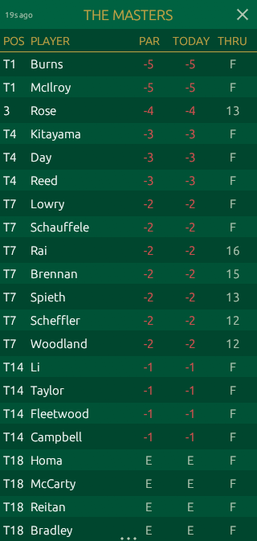

# Masters 2026

A lightweight, always-on-top desktop overlay that displays live leaderboard standings for The Masters golf tournament. Built in Rust with [egui](https://github.com/emilk/egui). Runs on Windows and macOS.




## Download

Grab the latest build from the [Releases](https://github.com/brennick/masters-overlay/releases/latest) page. No install required — just run it.

- **Windows**: `masters-overlay.exe`
- **macOS**: `masters-overlay-mac`

## Features

- **Always-on-top** frameless overlay window
- **1/8 screen width**, positioned on the right edge of your display
- **Auto-refreshes** scores every 60 seconds from the Masters API
- **Draggable** title bar (OS-native drag)
- **Resizable height** via bottom drag handle
- **Masters-themed** UI with Augusta green and gold color palette
- **Scrollable** leaderboard with alternating row colors
- **Score coloring** — red for under par, green for over par

## Controls

- **Drag** the title bar to move the window
- **Drag** the bottom edge (grip dots) to resize height
- **Click** the X button to close
- **Scroll** the leaderboard if it overflows

## Building from source

Requires [Rust](https://rustup.rs/) (stable).

```sh
cargo build --release
./target/release/masters-overlay      # macOS/Linux
./target/release/masters-overlay.exe  # Windows
```

## Data Source

Scores are fetched from the [Masters scores API](https://www.masters.com/en_US/scores/feeds/2026/scores.json) and refreshed every 60 seconds.

## License

MIT
